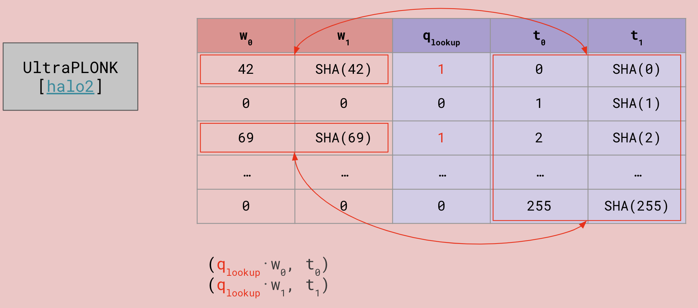
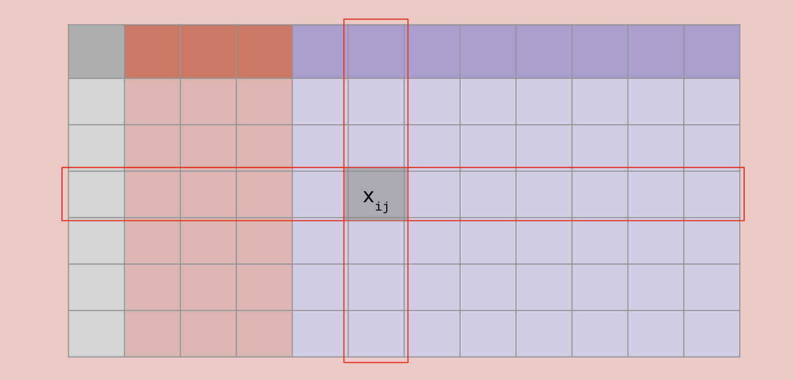
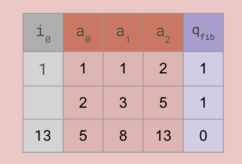

Halo2 Primer 1 - Overview
=========================

Youtube link: https://www.youtube.com/watch?v=W_zlH2mmtZA

## Overview

In a high level, Halo2 proof system consists of 3 components:

arithmetisation --> polynomial commitment scheme --> accumulation scheme

**Arithmetisation**: a way to express some relation and some satisfying witness to the relation as a low degree polynomial. Halo2 uses PLONKish arithmetisation.

**Polynomial Commitment Scheme**: Take the low degree polynomail, commit it to it, and provably evaluate it at challenging points. Halo2 uses inner product argument (there is a KZG verison tho).

**Accumulation Scheme**: Turns the verification of the proof into constant sized accumulator that is efficient to check and the expense of the check is linear to the size of the polynomial to be proven, and this check is amortized on a batch of proofs. That's where Halo2 enables recursion.

## PLONKish arithmetisation

PLONK [GWC19] -> TurboPLONK (with customized gates) [GW19] -> UltraPLONK (with lookup table) [Halo2]

### Vanilla PLONK

gates take two values as input, either add or multiply them, and then emit the result through an output wire.

$q_L \cdot x_a + q_R \cdot x_b + q_0 \cdot x_c + q_M \cdot (x_a x_b) = 0$

where the $q$s are pre-processed polynomials, also called selectors.  They are generated by the verifiers and they are "hardcoded" for your circuits and the $x$s are witted by the provers and have different values in each proving instances.

You could express add and mul just using this vanilla gates:

add: $1 \cdot x_a + 1 \cdot x_b + (-1) \cdot x_c + 0 \cdot (x_a x_b) = 0$
mul: $0 \cdot x_a + 0 \cdot x_b + (-1) \cdot x_c + 1 \cdot (x_a x_b) = 0$

### Custom Gates (TurboPlonk)

Custom gates are composed by arbitrary linear combinations o add, mul, and bool:

$q_{add} \cdot (a_0 + a_1 - a_2) + y \cdot q_{mul} \cdot (a_0 a_1 - a2) + y^2 \cdot q_{bool} \cdot (a_0 a_0 - a_0) = 0$

where $y$, $y^2$ are verifier generated challenges to keep gates linearly independent.

### Permutation Arguments

What is revolutionary of PLONK (vanilla PLONK) is the permuation arguments that allows us to enforce "global constraints". In the other words, it allows us to "route" the wires together.

- wires carry values into and out of the gates: "global" consistency check: do the wire correctly join the gates together?
  (for example, in Groth16, routing is baked into the trusted setup)

We can express the vanilla PLONK gates into a "table" as below:

| $w_0$     |   $w_1$    |    $w_2$   |  gate       |
|-----------|------------|------------|-------------| 
| $w_0[0]$  | $w_1[0]$   |  $w_2[0]$  |  $+$        |
| $w_0[1]$  | $w_1[1]$   |  $w_2[1]$  |  $\times$   |

Permutation argument is expressed in the language of Lagrange polynomials and root of unity. (more details later)

Each wire (column) is encoded as a Lagrange polynomial over the powers (rows) of the n-th root of unity $\{ 1, \omega, \ldots, \omega^{n-1} \}$, where $\omega^n = 1$:

$ w_i (\omega^j) = w_i [j] $

to enforce equality of wires, use permuation argument show that swapping $w_2(\omega^{\theta})$ with $w_{\theta}(\omega^1)$ doesn't change the polynomials.

### Lookup Argument (UltraPLONK)

For example, if you want to encode a very expensive hash function. Instead of writing constraints, you can load a lookup table, say, for the first 8-bits, with precomputed values of result and pre-image. When the prover is trying to use the hash function, it requires that witnesses look the pre-image and digest. You can view this as a lookup on the witness pairs of values. You demand that this pair of values appears in the pre-loaded lookup table. 

> Note: the lookup argument has to be evaluated to true on all rows

### Final Picture of Halo2's PLONKish arithmetisation

We can conceptualize the circuit as a **matrix** of $m$ columns and $n$ rows. Each column $j$ corresponds to a Lagrange interpolation polynomial $p_j(X)$. Each cell is the column polynomial evaluting to $p_j(\omega^i) = x_{ij}$, where $\omega$ is the $n$-th primitive root of unity.

Halo2 circuit's different kind of columns, (from left to right)
* Instance columns: public input columns shared among prover/verifier
* Advice columns: where the prover witness her private values
* Fixed columns: selectors, preprocessed values set at key generation

Example: How to express Fibonacci sequence in a Halo2 Circuit?

We can first express "local" constraints as follow:

* $q_{fib} \cdot (a_{0, cur} + a_{1, cur} - a_{2, cur}) = 0$
* $q_{fib} \cdot (a_{0, cur} + a_{1, cur} - a_{0, next}) = 0$
* $q_{fib} \cdot (a_{1, cur} + a_{2, cur} - a_{1, next}) = 0$

Then, there are global permuation:
* $a_2[i] = a_0[i+1]$
* $i_0[0] = a_0[0]$ // initialisation
* $i_0[0] = a_1[0]$ // initialisation
* $i_0[2] = a_2[2]$ // output